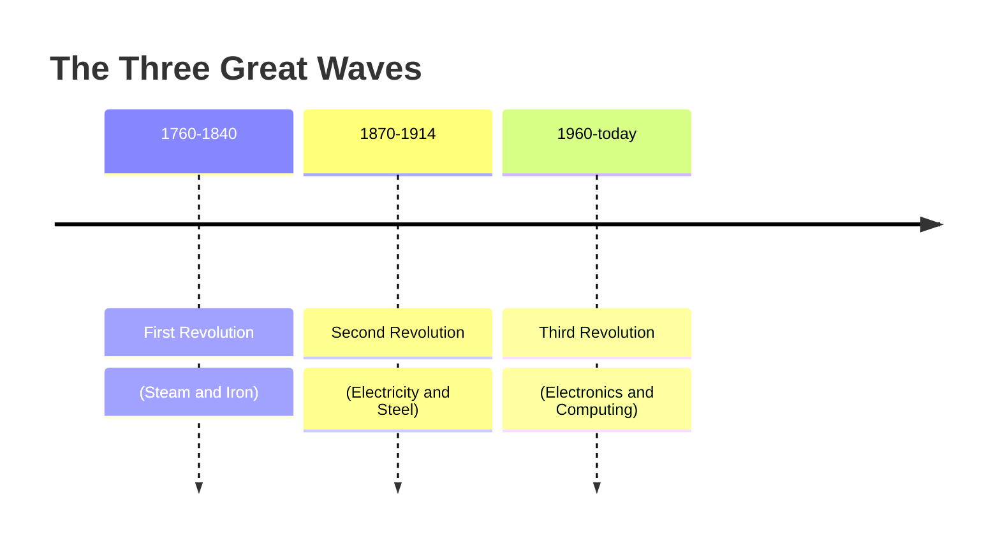
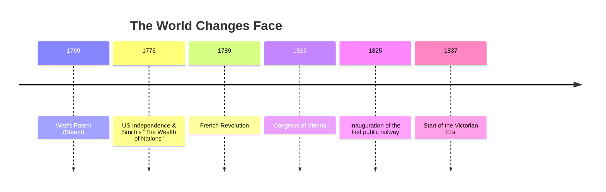
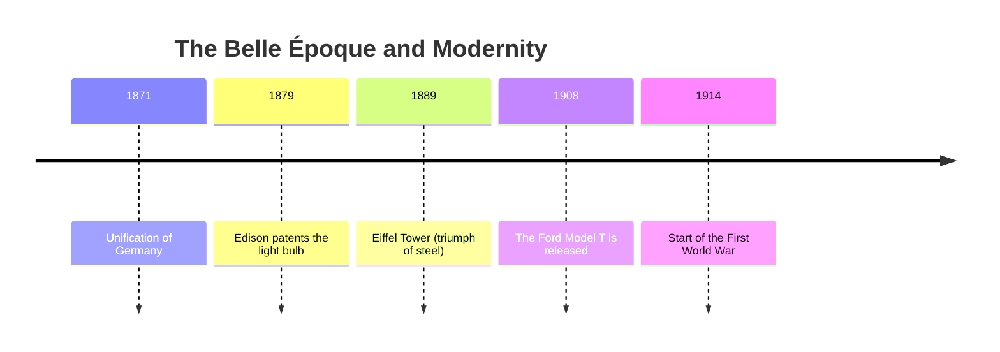
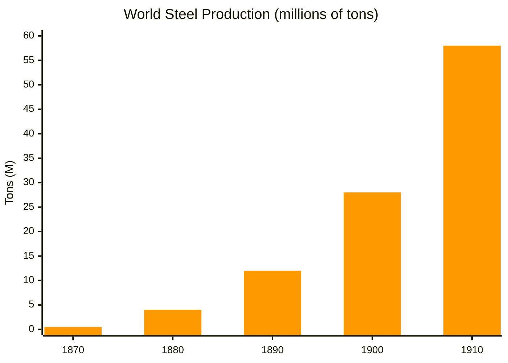
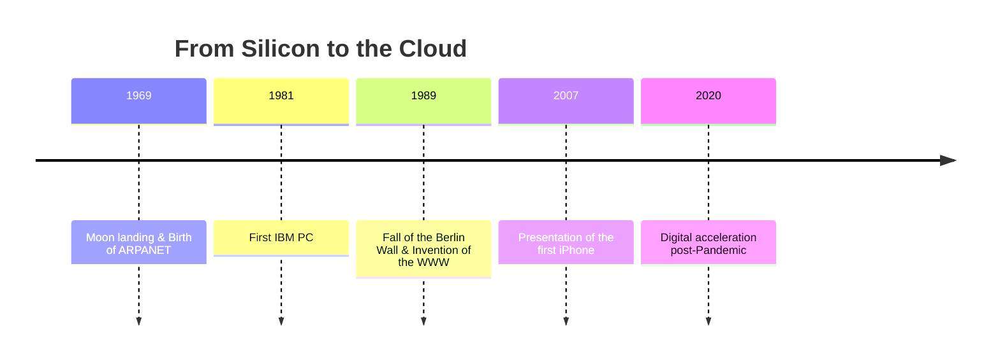
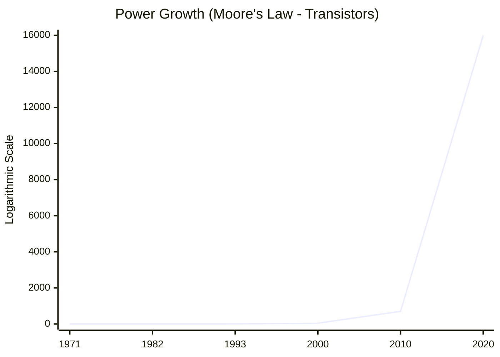

# **The Industrial Revolutions: A Journey Through Time**

## **Introduction**

The industrial revolutions are not simple lists of inventions, but true earthquakes that have reshaped the way we live, work, and think. Each phase has brought with it a paradigm shift: from muscle power to steam, from artisanal to mass production, up to the digital age.

To contextualize these changes, each section includes a **timeline** that connects technology to "Grand History."

-----

# **Time Overview**

-----

# **1. First Industrial Revolution (1760–1840)**

## *From the countryside to the factory: the age of steam*

This phase marks the definitive break with the agricultural past. Energy no longer depends on wind, water, or animals, but is artificially generated thanks to coal. The working class is born and industrial cities begin to expand rapidly.

-----

## **Historical Context (1760–1840)**

-----

## **Key Innovations**

  **Watt's steam engine:** The beating heart of the revolution, applicable everywhere, from mines to textile factories.
  
  
  
  **"Spinning Jenny" spinner:** Allowed for the weaving of multiple threads simultaneously, multiplying textile production tenfold.
  
  
  
  
  **Steam locomotive:** Shortened distances, allowing for the rapid transport of heavy goods and people.

-----

## **Stories and Curiosities**

### **The Legend of the "Jenny"**

It is said that James Hargreaves got the idea for his spinning machine by seeing his daughter Jenny's spinning wheel fall to the ground: the wheel continued to turn, but the spindle was vertical. He understood that multiple spindles could be managed simultaneously.

### **Stephenson's Rocket**

In 1829, during a competition, the "Rocket" locomotive outclassed the competition, reaching **45 km/h**. For the time, it was a terrifying speed, and inconceivable for a human being.

-----

## **Data: The Steam Explosion**

*(Estimate of the spread of steam engines in the UK)*

| Year | Number of Machines Installed | Impact |
| :--- | :--- | :--- |
| **1760** | \~5 | Experimental |
| **1800** | \~500 | Spread in mines |
| **1840** | \~3.000+ | Full industrial and railway use |

-----

# **2. Second Industrial Revolution (1870–1914)**

## *Science enters the factory: Electricity and Mass*

If the first revolution was based on practical mechanics, the second was born in scientific laboratories. It is the age of low-cost steel, chemistry, oil, and, above all, electricity that illuminates the nights and moves the assembly lines. Modern consumerism is born.

-----

## **Historical Context (1870–1914)**

-----

## **Key Innovations**

  \* **Electricity:** Flexible and transportable, it replaces steam in factories.
  
  

  
  \* **Steel:** Stronger and lighter than iron, it allows for enormous skyscrapers and bridges.
  
  \* **Internal combustion engine:** Opens the way for the automobile and, soon, the airplane.
  
  \* **Assembly line:** Taylorism and Fordism transform the worker into an efficient gear.

  
  

-----

## **Stories and Curiosities**

### **Light in New York**

When Edison flipped the switch at the Pearl Street Station in 1882, he brought light to 59 customers in Manhattan. The Wall Street bankers were the first who no longer had to work by gaslight.

### **The Model T Miracle**

Before the assembly line, assembling a car took 12 hours. Henry Ford reduced the time to **90 minutes**, making the automobile accessible to the middle class and no longer a toy for the rich.

-----

## **Chart: Steel Production**

*(Steel became the basic material of the modern world)*

-----

# **3. Third Industrial Revolution (1960–today)**

## *The age of information and the connected world*

This revolution does not move matter, but **information**. The invention of the transistor and the microchip has made it possible to automate mental and calculation processes. The world becomes a "global village" thanks to the Internet, breaking down geographical barriers in real time.

-----

## **Historical Context (1960–today)**

-----

## **Key Innovations**

  \* **Microprocessor:** Entire computers reduced to the size of a fingernail.

  
  
  \* **Internet & Web:** The democratization of access to knowledge.
  
  \* **Automation and Robotics:** Machines not only "do," but now "check" that the work is done.

  
  
  \* **Renewable Energy:** The search for a sustainable alternative to fossil fuels.
-----

## **Stories and Curiosities**

### **"LO": The first online message**

In 1969, student Charley Kline tried to send the word "LOGIN" between two computers. The system crashed after the first two letters. That "LO" was the beginning of the Internet.

### **Moore's Law**

Gordon Moore predicted in 1965 that computer power would double every two years. This prophecy has been self-fulfilling for decades, taking us from enormous mainframes to today's smartphones.

-----

## **Evolution of Computing Power**

-----

# **Conclusion: Towards Industry 4.0**

Today we are on the threshold (or perhaps already inside) the **Fourth Industrial Revolution**. It is not just about faster computers, but about systems that learn: **Artificial Intelligence, Big Data, Internet of Things (IoT)**, and the fusion between the biological and digital worlds.

If the first three revolutions extended our physical strength and our calculation capacity, the fourth promises to extend our capacity for prediction and adaptation.
